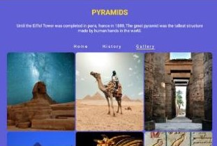
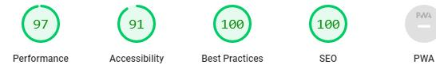
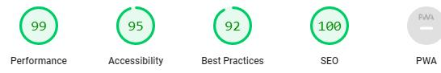

# Pyramids

Pyramids is a website that gives you a basic information about the great pyramids of giza egypt. Its a historical place to visit. And get a wow factor how humans were able to did this more than 4600 years ago. website may inspire you to visit pyramids, and you can see with your own eyes.

## Features
- Navigation

My website got three pages (Home, History, Gallery).

- The Header

Each page has a interesting heading under the website name.

- Body

Home page got a nice video, History page also tells you about pyramids history and gallery page got some good pictuers.

- Social Media

website also got link to social media.

## Testing

I tested the website working in chrome, Edge, firefox. and Sadari browsers. I confirmed that this website is responsive, and function all standard screen sizes using devtools.

## Optimizations & Testing

HTML.

No error were returned when passing through the offical W3C validator.

CSS.

No error were found when passing through the offical validator.

Accessibility.

I confirm that color and fonts chosen are easy to read and accessible by running it through in devtools.

Home

 

History

 

Gallery

 

## Unfix Bugs
video autoplay loop not working on chrome, and edge browser. but its working on firefox, and safari.

## Deployment

[Website Link](https://kamran082.github.io/Pyramids/index.html)

## credits
Media.

The images and video in the website was taken from Pexels.

Text. 

website text was search throught the google search engine.

Fonts. 

Fonts used in website from FontAwesome .

THANK YOU.